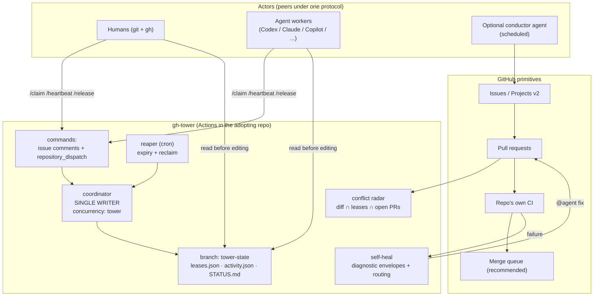

# Architecture

## Components

## Design principles

| # | Principle | Consequence |
|---|---|---|
| P1 | Serialize **integration**, not development | Actors never wait for each other; a merge queue (or auto-merge) is the only serialization point. |
| P2 | GitHub **is** the message bus | All agent-to-agent communication = issues, comments, labels, dispatch events. Auditable, replayable, human-visible, zero infra. |
| P3 | Single-writer state | One workflow writes the ledger, serialized by a `concurrency` group. Race-free by construction; git history = audit log. |
| P4 | Advisory leases, mandatory checks | Soft locks preserve velocity; correctness is enforced by CI/queue where it's cheap. Exclusive leases only for declared protected paths. |
| P5 | Bounded autonomy | Self-heal retry budget, max concurrent agent workers, kill switch (`TOWER_ENABLED` repo variable). Degrades to plain PR flow, never blocks shipping. |
| P6 | Vendor neutrality | The protocol is schemas + comment grammar. Any actor with a token participates; agent-specific bits (fix-mention syntax) are configuration. |

## Why not X?

- **A coordination server (Redis/Postgres + bot):** real infra to operate, state invisible to humans, another auth surface. GitHub already provides atomic-enough primitives + UI + audit.
- **Multi-agent frameworks (LangGraph, CrewAI, AutoGen):** they orchestrate agents *inside one process*. Repo coordination is cross-process, cross-vendor, days-long, and includes humans — it needs durable shared state, not an event loop.
- **CODEOWNERS / path ownership:** assumes boundaries exist. gh-tower is built for the case where everyone touches everything.
- **Hard file locking:** blocks the fast path to protect against the rare path. Advisory + radar + queue catches the same failures without stalling anyone.

## Failure modes

| Failure | Detection | Behavior |
|---|---|---|
| Coordinator broken | STATUS.md staleness | System degrades to plain PR flow; leases go stale but CI/queue still guard `main`. |
| Actor ignores protocol | radar sees diff with no lease; audit log has no claim | PR labeled; conductor/humans correct the actor's instructions. |
| Agent fix ping-pong | envelope attempt counter | retry budget → `needs-human`. |
| State branch race | impossible by design | single writer + concurrency group; push uses rebase-retry as belt-and-braces. |
| GitHub outage | — | nothing to do; the repo itself is down. No extra availability liability was added. |
